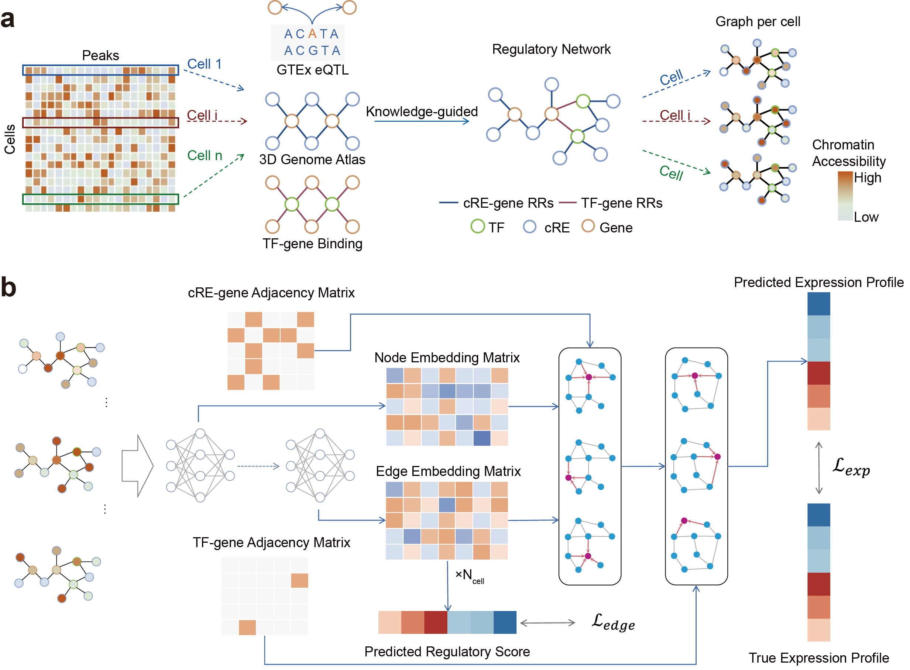

# scReGAT

This repository contains the code for scReGAT, a deep learning framework for predicting long-range gene regulation at single-cell resolution, as described in our paper:

**Leveraging knowledge of regulatory interactions to predicting long-range gene regulation at single cell resolution with scReGAT**

## Introduction

Understanding gene regulation at single-cell resolution is crucial for unraveling the complexities of development, disease, and cellular identity. scReGAT (single-cell Regulatory Graph Attention Network) is a deep learning framework that integrates prior knowledge of cis-regulatory element (cRE)-gene and transcription factor (TF)-gene interactions to reconstruct cell-specific regulatory networks.

At the core of scReGAT is a knowledge-guided regulatory graph (kRG), which combines experimentally validated regulatory interactions with cell-resolved chromatin accessibility profiles. This graph serves as the foundation for training a Graph Attention Network (GAT) that predicts gene expression and quantifies the contribution of specific regulatory interactions using an interpretable regulatory probability (RP) for each edge.

scReGAT has been benchmarked across five single-cell multi-omics datasets and has been shown to:

- Successfully recapitulate known cell-type-specific cRE-gene interactions.
- Uncover dynamic regulatory rewiring that predicts transcriptional transitions in neuroblastoma and osteogenic differentiation systems.
- Identify disease-associated cell types and uncover candidate regulatory mechanisms underlying complex trait associations by integrating GWAS loci.

## Architecture

The scReGAT framework is composed of two main stages: knowledge-guided regulatory graph (kRG) construction and a graph attention network (GAT) for gene expression prediction and regulatory interaction scoring.



_Figure 1: An overview of the scReGAT framework, from data integration and graph construction to the GAT-based model for predicting gene expression and inferring regulatory probabilities._

## Installation

```bash

conda create -n scregat python=3.10 -y
conda activate scregat

conda install -y pandas=1.5.3 numpy=1.24 scipy=1.11.4 scikit-learn statsmodels numba matplotlib seaborn pybedtools

pip install torch==2.3.1 torchvision==0.18.1 torchaudio==2.3.1

pip install torch_geometric

git clone https://github.com/TianLab-Bioinfo/scReGAT.git
cd scReGAT

pip install .
```

## Qucik Start

1. Download `data.zip` from [here](https://drive.google.com/file/d/1tG2u2foUMJkunb-LBt_mhtm-nN3s59E3/view?usp=sharing) and unzip it to the `data/` directory.
2. Download the gold standard data files required for reproduction from [here](https://drive.google.com/file/d/1eO3KzlA6ZK_v2ogYejiX1xBPZwXVOGcK/view?usp=sharing)

Please see `notebook/` for examples.

## Contact Us

If you encounter any issues during use or have any suggestions, feel free to contact us:

- Baole Wen: blwen24@m.fudan.edu.cn
- Yi Long : longy25@m.fudan.edu.cn

  You can also submit an issue on GitHub.

For more information about our research, please visit our lab website: [Tian Lab](https://tianlab-bioinfo.github.io/).

## Citation

If you use scReGAT in your research, please cite:

```

```
